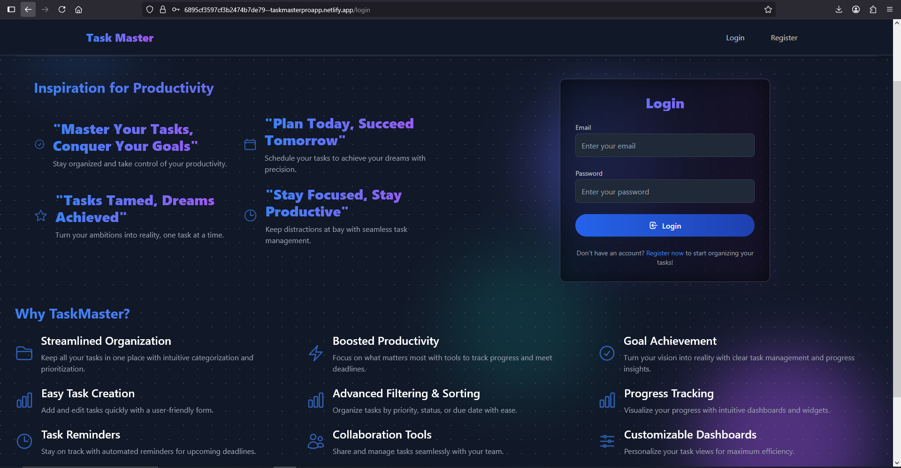
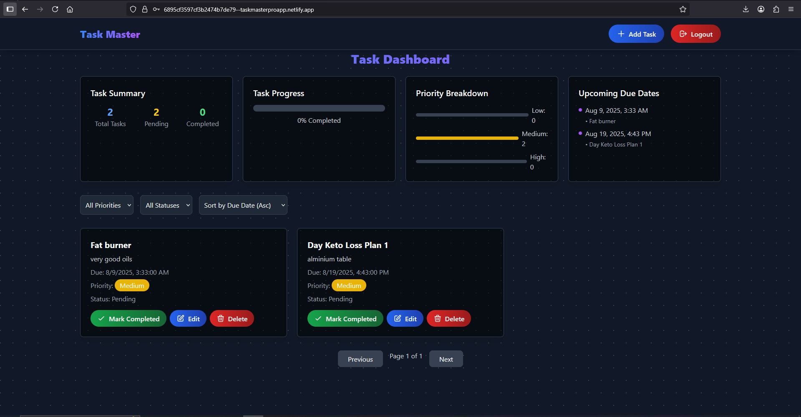
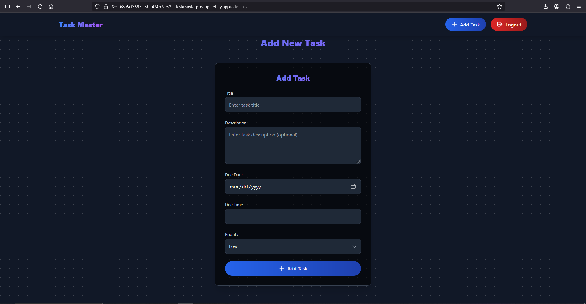
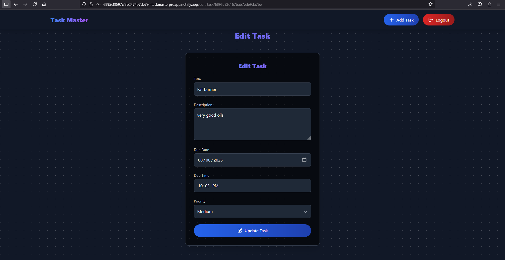

# Task Manager Web App

A full-stack task management application built with a React frontend and a Node.js/Express/MongoDB backend. The app allows users to register, log in, and manage tasks with features like creating, editing, deleting, filtering, sorting, and paginating tasks. The UI is styled with Tailwind CSS and includes a user avatar via `boring-avatars`. The app enforces a due date restriction for tasks (from today, 2025-08-08, onward). Deployed on Netlify (frontend) and Railway (backend).

## Table of Contents
- [Features](#features)
- [Screenshots](#screenshots)
- [Setup Instructions](#setup-instructions)
- [API Documentation](#api-documentation)
- [Deployed Links](#deployed-links)
- [Postman Collection](#postman-collection)
- [Demo Video](#demo-video)
- [Contributing](#contributing)
- [License](#license)

## Features
- **User Authentication**: Register and log in with JWT-based authentication.
- **Task Management**: Create, read, update, and delete tasks.
- **Task Filtering & Sorting**: Filter by status (Pending/Completed) and sort by priority or due date.
- **Pagination**: Paginated task list for efficient browsing.
- **Due Date Restriction**: Task due dates restricted to today (2025-08-08) or later in `TaskForm.js` and `EditTask.js`.
- **Responsive UI**: Built with Tailwind CSS and `boring-avatars` for user avatars.
- **SPA Routing**: Seamless navigation using `react-router-dom`.

## Screenshots
*Note: Replace placeholders with actual screenshot paths after uploading.*

- **Login Page**: 
- **Dashboard**: 
- **Add Task Form**: 
- **Edit Task Form**: 

## Setup Instructions

### Prerequisites
- Node.js (v18.x recommended)
- MongoDB Atlas account
- Git
- Netlify CLI (`npm install -g netlify-cli`)
- Railway CLI (`npm install -g railway`)


### Frontend Setup
1. Clone the repository:
   ```bash
   git clone https://github.com/malinduyasanjith8090/Task-Manager-Web-App.git
   cd Task-Manager-Web-App/frontend

### Deployed Links
- **Frontend**: [https://taskmasterproapp.netlify.app](https://taskmasterproapp.netlify.app)
- **Backend**: [https://task-manager-web-app-production.up.railway.app](https://task-manager-web-app-production.up.railway.app)

## Demo Video
[](https://youtu.be/OeeLhdVApqE) 